Core Concepts
=============

## Table of Contents

1. [Core Concepts](#core-concepts)
   1. [Table of Contents](#table-of-contents)
   2. [Cluster Architecture](#cluster-architecture)
   3. [ETCD](#etcd)
      1. [ETCD For Beginners](#etcd-for-beginners)
      2. [ETCD in Kubernetes](#etcd-in-kubernetes)
   4. [Kube-API Server](#kube-api-server)
   5. [Kube Controller Manager](#kube-controller-manager)
   6. [Kube Scheduler](#kube-scheduler)
   7. [Kubelet](#kubelet)
   8. [Kube Proxy](#kube-proxy)
   9. [PODs](#pods)
      1. [Recap](#recap)
      2. [How to deploy Pods](#how-to-deploy-pods)
      3. [PODs with YAML](#pods-with-yaml)


## Cluster Architecture


* Two kinds of ships
    * Cargo Ships that does the actual work of carrying containers across the sea
    * Control ships that are responsible for monitoring the cargo ships

* Worker Nodes - 
    * Host application as containers

* Master Node - Control Ship
    * Manage, Plan, Schedule, Monitor Nodes
    * Since there is so much info coming all the time, need to maintain info about different "ships", which container is on which "ship" and what time it was loaded, etc.
    * Stored in a highly available key value store known as *Etcd*
    * *Etcd*: A database that stores information in a key-value format
    * *Scheduler*: When ships arrive, you load containers on them using cranes, the cranes identify the containers that need to be placed on ships. 
      * It identifies the right ship based on its size, its capacity, the number of containers already on the ship. and any other conditions such as the destination of the ship
      * *kube-scheduler*

* Different offices in the dock that are assigned to speical tasks or departments
    * ie. Operations team takes care ship handling, traffic control, etc. deal with issues related to damages, the routes take
    * Cargo team takes care of containers. When containers are damaged or destroyed, they make sure new containers are made available
    * Services office that takes care of the I.T and communications between different ships. 

* Controller Manager: In Kubernetes we have controllers available that take care of different areas. 
  * Node-Controller - takes care of nodes
    * onboarding new nodes to cluster, 
    * handling situations where nodes become unavailable or get destroyed.
  * Replication-Controller - ensures desired number of containers are running at all time.  

* kube-apiserver is primary management component of kubernetes. 
  * Responsible for orchestrating all operations within the cluster. 
  * exposes the Kubernetes API which is used by external users to perform mangement operations on the cluster as well as the various controllers to monitor the various state of the cluster and make the necesssary changes as required by the worker nodes to communicate with the server. and by the worker nodes to communicate with the server. 

* Container Runtime Engine
  * Docker is a popular one
  * Not always docker though, could be things like container-d or rocket.

* The captain of the ship. Every ship has one. Responsible for managing all activities on these ships
  * Responsible for liasing with master ships starting with: 
    * letting the master ship know that they are interested in joining the group
    * receiving the appropriate info about the containers to be loaded on the ship
    * and loading the appropriate containers as required
    * Sending reports back to the master about the status of this ship and status of containers on ship
  * captain of the ship is *kubelet* 
* Kubelet is an agent that runs on each node in a cluster
  * Listens for instructions from the kube-api server and deploys or destroys containers on the nodes as required. 
  * Kube-api server periodically fetches status reports from kubelet to monitor the state of the nodes and containers on them

* *Kube-proxy*: Applications on worker nodes need to be able to communicate with each other
  * Ie you may have a web server running in a container on one node and a db server on the other node. 
  * How would the web server reach the database server on the other node?
  * Kube-proxy service ensures that the necessary rules are in place on the worker nodes to allow the containers running on them to reach each other. 

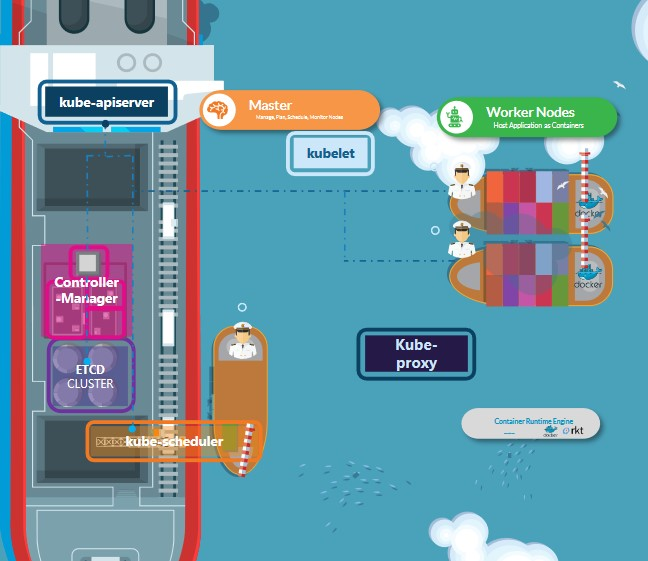
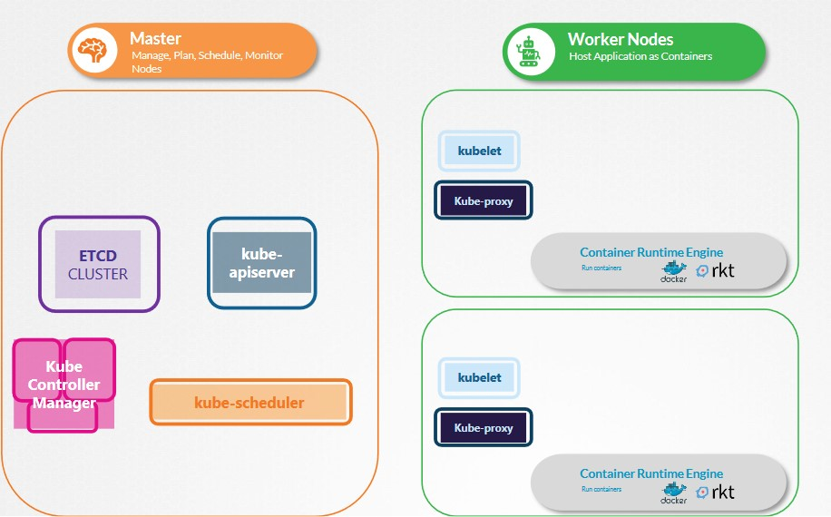

## ETCD

### ETCD For Beginners
* *ETCD is a disbritued, reliable key-value store that is simple, secure, and fast*
* Key value store
  * A dictionary basically
  * Stores info in the form of documents or pages
* Install ETCD
  * Download Binaries
    * `curl -L https://github.com/etcd-io/etcd/releases/download/v3.3.11/etcd-v3.3.11-linux-amd64.tar.gz -o etcd-v3.3.11-linux-amd64.tar.gz`
  * Extract
    * `tar xzvfetcd-v3.3.11-linux-amd64.tar.gz`
  * Run ETCD Service
    * `./etcd`
    * Starts a service that listens on port 2379 by default and can then attach any clients to the ETCD service to store and retrieve info
    * Default client that comes with etcd is the etcdctl client. use it to store and retrieve key value pairs
      * `./etcdctlset key1 value1`
      * `./etctl get key1`
        * returns `value1`

### ETCD in Kubernetes 
* ETCD Cluster stores info such as:
  * Nodes
  * PODs
  * Configs
  * Secrets
  * Accounts
  * Roles
  * Bindings
  * Others
* All the info you see when you run the `kubectl` command is from the ETCD server. 
* every change you make to your cluster, such as adding additional nodes, deploying pods or replica sets are updated are in the ETCD server.
  * Change isn't considered completed until it's updated in the ETCD server

* ETCD is deployed differently depending on how you set up your cluster
  * Manual Deployment: 
    * Download binaries 
      * `wget-q --https-only \"https://github.com/coreos/etcd/releases/download/v3.3.9/etcd-v3.3.9-linux-amd64.tar.gz"`
      * `etcd.service`
        * `--advertise-client-urls https://${INTERNAL_IP}:2379\\`
        * 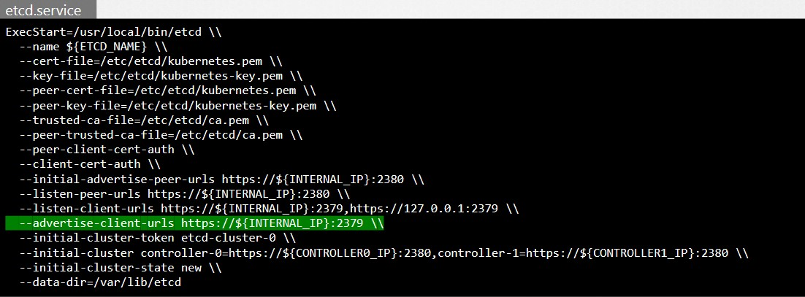
  * Setup - Kubeadm
    * `kubectl get pods -n kube-system`
      * 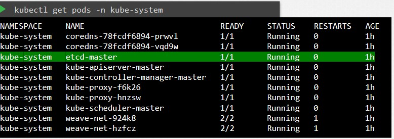
    * `kubectlexec etcd-master –n kube-systemetcdctlget / --prefix –keys-only`

* ETCD in HA Environment
  * You will have multiple master nodes in your cluster then you will have multiple ETCD instnaces spread across the master nodes
  * Set the right parameter `--initial-cluster controller-0=https://${CONTROLLER0_IP}:2380,controller-1=https://${CONTROLLER1_IP}:2380 \`

## Kube-API Server

* When you run a kubectl command, the kubectl is reaching to the kube-apiserver
  * Kubeapi server authenticates the request and validates it
  * then retrieves the data from the etcd cluster and responds back with the requested info

* don't really need to use kubectl. could instead invoke api directly by sending a post request
* IE: Creating a pod with POST
  * `curl –X POST /api/v1/namespaces/default/pods ...[other]`
    1. Authenticate User
    2. Validate Request
    3. Retrieve Data
    4. Update ETCD 
    5. Scheduler
    6. Kubelet
   * Returns `Pod created!`
     * API Server creates a POD object without assinging it to a node
     * Updates the info in the ETCD server
     * Updates the user that the POD has been created
     * The scheduler continuously monitors the API Server and realizes there is a new pod with no node assigned
       * Scheduler identifies the right node to place the new POD on and communicates that back to kube-api server
     * API server then updates the info in the etcd cluster. 
     * The api server then passes that information to the kubelet in appropriate worker node.
     * Kubelet then creates the pod on the node and instructs the container runtime engine(docker) to deploy the application image. 
     * Kubelet updates the status back to the API server and the API server then updates the data back in the ETCD cluster. 
   * Kube-apiserver is at the center of all the different tasks that needs to be performed to make a change in the cluster.

* Kube-api server is the only component that interacts directly with the etcd datastore. 

* Setting up the hard way, kube-apiserver is available as a binary in the kubernetes release
  * `wgethttps://storage.googleapis.com/kubernetes-release/release/v1.13.0/bin/linux/amd64/kube-apiserver`
  * `kube-apiserver.service`
    * `--etcd-servers=https://127.0.0.1:2379 \\`
  * Some of the important 
* View APi-server -kubeadm
  * `kubectl get pods -n kube-system`
    * `kube-apiserver-master`
* View api-server options - kubeadm 
  * `cat /etc/kubernetes/manifests/kube-apiserver.yaml`
  * See running processes with `ps -aux | grep kub-apiserver`

## Kube Controller Manager 

* Kube controller manager manages various controllers in kubernetes
* Controller is like an office or department within the master ship 
  * An office for the ships would be responsible for monitoring and taking necessary actions about the ships whenever a new ship arrives or when a ship leaves/gets destroyed.
  * Another office could be one that manages containers of the ship. 

* Officers are 
  1. Continuously on the lookout for the status of the ships 
  2. takes necessary actions to remediate the situation

* *Controller* 
  * A process that continuously monitors the state of various components within the system and works towards brigning the whole system to the desired functioning state
  * For example - Node Controller is responsible for monitoring the status of the Nodes and taking necessary actions to keep the nodes running.

* Node controller checks the status of the nodes every 5 seconds    
  * That way the node controller can monitor health of nodes. If it stops receiving heartbeat from a node, marked as unreachable.
  * Waits 40 seconds to mark it as unreachable. 
  * If a node is marked unreachable, it gets 5 minutes to come back up
    * if it doesn't, removes the pods assigned to that node and provisions them on the healthy ones if pods are part of a replica set. 

* Replication Controller
  * Responsible for monitoring the status of replica sets and ensuring that the desired number of pods are available at all times within the set
  * If a pod dies, it creates another one. 

* Plenty of types of controllers. Whatever concepts we have seen so far in kubernetes such as deployments, services, namespaces, Persistent volumes, implemented through these controllers

* How do you see these controllers? 
  * In the Kube-Controller-Manager
  * Download the kube-controller-manager and run it as a service
    * `wget https://storage.googleapis.com/kubernetes-release/release/v1.13.0/bin/linux/amd64/kube-controller-manager`
    * `kube-controller-manager.service`
    * Option called controllers to see which one is enabled. by default, they are all enabled. 

  * Or with kubeadm
    * `kubectl get pods -n kube-system`
      * Deploys kube-controller-manager as a pod in the kube-system namespace on the master node. 
      * can view options with `cat /etc/kubernetes/manifests/kube-controller-manager.yaml`
  * WIthout you can run `cat /etc/systemd/system/kube-controller-manager.service` 

* See running processes with `ps -aux | grep kube-controller-manager`


## Kube Scheduler

* Scheduler is only responsible for deciding which pod goes on which node. It doesn't actually place the pod on the node
  * That's the kubelet.

* Why do you need a scheduler? 
  * want to make sure the right container ends up on the right ship. 
  * Want to make sure contrainers are placed on right ship so they go to the right place. 

* Scheduler looks at each pod and tries to find the best node for it. 
  * Two Phases:
    * First Phase - Filter Nodes:
      * Filter out nodes that dont fit profile of pods ie. Nodes that don't have sufficient CPU and memory resources requested by the pod.
    * Second Phase - Rank Nodes: 
      * Uses a priority function to assign a score to the nodes on a scale of 0 to 10. That would be free on the nodes after placing the pod on them 
        * So whichever has more resources would be placed on. 

* Installing Kube-scheduler 
  * download binary and run it as service. 
    * `wget https://storage.googleapis.com/kubernetes-release/release/v1.13.0/bin/linux/amd64/kube-scheduler`
    * `kube-scheduler.service`


## Kubelet
* Kubelet is like the captain on the ship
* Lead all activities on the ship!
* Send reports at regular intervals on the status of the ship and the containers on them.


* Kublet in the kubernetes worker node, registers the node with the kubernetes cluster. 
* When it recieves instructions to load a container or a POD on the node, it requests the container run time engine(docker) to pull required image and run an instance. 
* Kubelet then continues to monitor the state of the POD and the containers in it and reports to the kube-api server on a timely basis

1. Register Node
2. Create PODs
3. Monitor Node & PODs

* Install kubelet:
  * Kubeadm does not deploy kubelets.
  * You must always manually install kubelet on the worker nodes.
    * `wget https://storage.googleapis.com/kubernetes-release/release/v1.13.0/bin/linux/amd64/kubele`
    * `kubelet.service`
  * View Kublet options
    * `ps -aux | grep kubelet`

## Kube Proxy

* Every pod can reach every other pod.
* This is accomplished by deploying a POD networking solution to the cluster.
  * POD Network - an internal virtual network that spans across all the nodes in the cluster through which all the pods connect to. 
  * Many solution available to deploying such a network
* Example: In this case, I have a web application deployed on the first node and a database aplication deployed on the second.
  * Web app can reach the database by using the IP of the db pod. 
  * No guaruntee that the ip of the database pod will always remain the same.
  * Better way for web app to access the db is using a service. so we create a service to expose the db application across the cluster. 
  * The service cannot join the pod network because the service is not an actual thing. 
    * Not a container like pod so it doesn't have any interfaces or an actively listening process. virtual component that only lives in the kubernetes memory. 
  * Kube-proxy is a process that runs on each node in the kubernetes cluster
    * Job is to look for new services and every time a new service is created, it creates the appropriate rules on each node to forward traffic to those services to the backend pods
    * One way it does this is by using IPTABLES rules
      * In this case it creates an IP tables rule on each node in the cluster to forward traffic heading to the IP of the service which is 10.96.0.12to the IP of the actual pod which is 10.32.0.15
  * 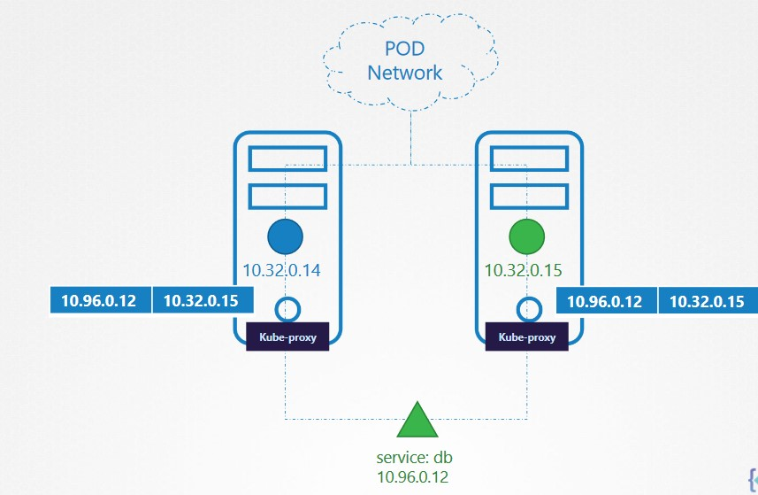

* Installing Kube-proxy
  * `wget https://storage.googleapis.com/kubernetes-release/release/v1.13.0/bin/linux/amd64/kube-proxy`
  * or `kubectl get pods -n kubesystem` with kubeadm.
  * `kubectl get daemonset -n kube-system`

## PODs

### Recap

* WIth kubernetes, ultimate aim is to deploy our application in the form of containers on a set of machines that are configured as worker nodes in a cluster. 
* Kubernetes does not deploy containers directly on worker nodes.
  * Instead the containers are encapsulated into a kubernetes object known as PODs.
  * **Pod:** Single instance of an application
    * Smallest thing you can create in kubernetes
* Simplest of simple instance one  instance of application running in a single docker container encapsulated in a POD
  * As it scales, spin up additional instances by creating a new pod with a new instance of the same application
  * If user base further increases and current node has no sufficient capacity, create a new pod on a new node in the cluster. 
  * PODS usually have a 1 - 1 relationship
  * To scale up, you create new pods
    * Scale down delete pods

* Multi-Container PODs
  * A single pod can have multiple containers except for the fact that they're usually not multiple containers of the same kind
  * If intention was to scale our application, then we would need to create additional pods
  * **Helper Container**
    * supporting task for our web app such as processing a user entered data processing a file uploaded by the user etc. and want helper containers to live alongside application container
      * In that case you can have both of these containers part of the same pod so that when a new application container is created, the helper is also created and when it dies, the helper also dies since they are part of the same pod. 
      * The two containers can also communicate with each other directly by refering to each other as localhost. 
      * Can also share same storage space

### How to deploy Pods
* `Kubectl run nginx` 
  * deploys a docker container by creating a POD. So first creates a POD automatically and deploys an instance of the nginx docker image. 
    * Where does it get app image from? 
      * `--image nginx` command so `kubectl run nginx --image nginx`
      * See pods available with `kubectl get pods`


### PODs with YAML

* YAML in kubernetes
* pod-defintion.yml
* ```yaml
  apiVersion:
  kind: 
  metadata:

  spec:
  ```
* all required fields!!
  * `apiVersion: v1` could also be `apps/v1`
  * kind could be `POD`, `Service`, `ReplicaSet`, `Deployment`
  * **metadata**:
    * ```yaml
      metadata: 
        name: myapp-pod
        labels: 
            app: myapp
            type: front-end   
      ```
    
*  Metadata is a dictionary. number of spaces doesn't matter but they should stay the same since they are siblings
   * cannot add any other property that you want in metadata. 
 * For spec, refer to documentaion since there are plenty. With app that has a single container though, not too tough
  ```yaml
  spec:
    containers:
      - name: nginx-container
        image: nginx
  ```
  * dash(-) indicates that it is a list and first item in the list. 
 * when yaml is made, run `kubectl create -f pod-definition.yml`
 * Delete pod with `kubectl delete myapp-pod`
 * Once pod is created, run `kubectl get pods` to view pods available.
   * to see detailed info about pod run `kubectl describe pod myapp-pod` 

## ReplicaSets

* They are the processes that monitor kubernetes objects and respond accordingly. 

* Why do we need replica set
  * If something happens and pod fails, users will no longer be ale to access our application
  * to prevent users from losing access to our app, we would like to have more than one insance or pod running at the same time. 
  * Replication controller helps us run multiple instances of a single pod in the kubernetes cluster and providing high availability
* Can you use replication controller if you plan on using a single pod? 
  * **NO** Even if you havea single pod, the replication controller can help by automatically bringing up a new pod when the existing one fails. 
  * Thus the replication controller ensures that the specified number of parts are running at all times. 

* Also need to create multiple pods to share load across them. 
* 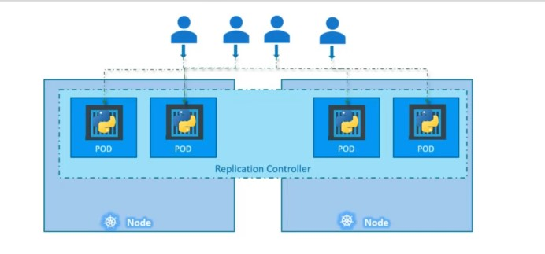

* Two similar terms for when the demand increases both have same purpose but not the same. 
  * **Replication Controller** 
    * The older tech that's being replaced by replica set. 
  * **Replica Set** 
    * New recomended way to set up replication

### Creating a Replication Controller

`rc-definition.yml`
```yaml
apiVersion: v1
kind: ReplicationController
metadata:
  name: myapp-rc
  labels:
    app: myapp
    type: front-end

spec:
  template:
    metadata:
      name: myapp-pod
      labels:
        app: myapp
        type: front-end
    spec:
      containers:
        - name: nginx-container
          image: nginx
  
  replicas: 3


```
* create template section under spec to provide a part template to be used by the replication controller
  * move all the contents of the pod-defintion file except for the first few lines and put it in the rc-defintion file
  * Replication controller is parent, pod definition is child
  * for replica count, add replicas tag to spec and input the number of replicas you'll need under it. 
  * then run `kubectl create -f rc-definition.yml`
    * when created, it also creates the pods.
  *  to see replicas, run `kubectl get replicationcontroller` command and it will give you number of replicas. 

### Creating a ReplicaSet

`replicaset-definition.yml`
```yaml
apiVersion: apps/v1
kind: ReplicaSet
metadata: 
  name: myapp-replicaset
  labels:
    app: myapp
    type: front-end
  

spec:
  template:
    metadata:
      name: myapp-pod
      labels:
        app: myapp
        type: front-end
    spec:
      containers:
        - name: nginx-container
          image: nginx
  
  replicas: 3
  selector:
    matchLabels:
      type: front-end

```

* Need to have the apps/ or you will get an error: unable to recognize replicaset
* ReplicaSet needs `selector:` 
* Can also manage parts that were nt created as part of the replica at creation
  * ie. The reports created before the creation of the replica set that match labels specified in the selector.
  * Replica set will also take those pods into consideration when creating the replicas. 
* can still use `selector:` in replicacontroller but just assumes it is the same as the labels provided in the part defintion file
* Required for ReplicaSet and has to be written in form of matchLabels: 
  * Simply matches the labels specified under it to the labels on the pod. 
  * Replica set selector also provides many other options for matching labels that were not available in the replication controller

* to create run `kubectl create -f replicaset-definition.yml`
  * to see list of pods, run `kubectl get replicaset`

### Labels and Selectors
* How ReplicaSet knows which pods to monitor
* Labeling comes in handy here. 
  * Can provide labels as a filter for replica set
  * under the selector section we use `matchLabels` and provide the same label we used while creating the pod. 

* Scale: 
  * Update the number of replicas in the definition files to 6
    * Run `kubectl replace -f replicaset-definition.yml` to update the replicaset to have 6 replicas
  * run `kubectl scale --replicas=6 -f replicaset-definition.yml` or `kubectl scale --replicas=6 myapp-rep`
    * using file name as input will not result in the number of replicas being updated automatically

* Commands
  * `kubectl create -f replicaset-definition.yml` creates replicaset
  * `kubectl get replicaset` see list of replicasets created
  * `kubectl delete replicaset myapp-replicaset` *also deletes all underlying pods.
  * `kubectl replace -f replicaset-definition.yml` to update it after making changes
  * `kubectl scale --replicas=6 -f replicaset-definition.yml` 
  * `kubectl edit replicaset new-replica-set` modifies the image, you can save out of tmp by running `:w [filename]`

## Deployments

### What is a Deployment

* Things you want in a deployment: 
  * Say you have a web server that needs to be deployed in a production environment
  * You need not one, but many instances running
  * Whenever newer versions or builds become available on the docker registry, you would like to upgrade your builds seamlessly
    * But not all at the same time since it may impact users
    * may want to upgrade one after the other
  * Would like to be able to roll back
  * Would like to make multiple changes to environment, don't want to make changes immediately
    * but apply a pause to your environment, make changes and then resume so that all changes are rolled out at the same time.
* **Kubernetes can do that** 

* Pods -> Replica Set -> Deployment
  * Deployment can update underlying instances seamlessly. 
  * 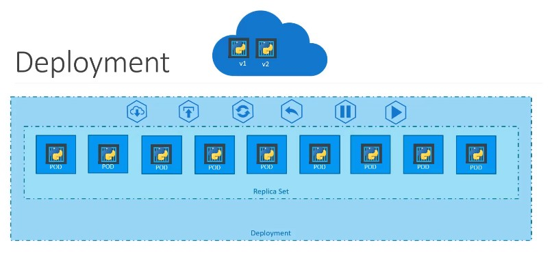

### Definition
Same as replica set except kind will now be `Deployment`
`deployment-definition.yml`
```yaml
apiVersion: apps/v1
kind: Deployment
metadata:
  name: myapp-deployment
  labels:
    app: myapp
    type: front-end
spec:
  template:
    metadata:
      name: myapp-pod
      labels:
        app: myapp
        type: front-end
      spec:
        containers:
          - name: nginx-container
            image: nginx
  replicas: 3
  selector:
    matchLabels:
      type: front-end
```
* `kubectl create -f deployment-definition.yml`
* `kubectl get deployments`
* `kubectl get replicaset` will get the replicaset in the deployment
* `kubectl get pods` 
* Basically the same as replicaset except that it created a deployment object.
* `kubectl get all` shows all created objects at once. 

## Helpful Pod Commands
* Create an NGINX Pod
  * `kubectl run --generator=run-pod/v1 nginx --image=nginx`
* Generate POD Manifest YAML file (`-o yaml`) Don't create it(`--dry-run`)
  * `kubectl run --generator=run-pod/v1 nginx --image=nginx --dry-run -o yaml`
* Create a deployment
  * `kubectl run --generator=deployment/apps.v1 nginx --image=nginx`
* Generate Deployment YAML file (`-o yaml`). Don't create it(`--dry-run`)
  * `kubectl run --generator=deployment/apps.v1 nginx --image=nginx --dry-run -o yaml`
* Generate Deployment YAML file (-o yaml). Don't create it(--dry-run) with 4 Replicas (--replicas=4)
  * `kubectl run --generator=deployment/apps.v1 nginx --image=nginx --dry-run --replicas=4 -o yaml`
* Save it to a file - (if you need to modify or add some other details before actually creating it) 
  * `kubectl run --generator=deployment/apps.v1 nginx --image=nginx --dry-run --replicas=4 -o yaml > nginx-deployment.yaml`


## Namespaces

### Basics

* Two boys named Mark, to address each other, they use last names. 
  * In their house though with families, they address by first name because there isn't another mark there. 
  * 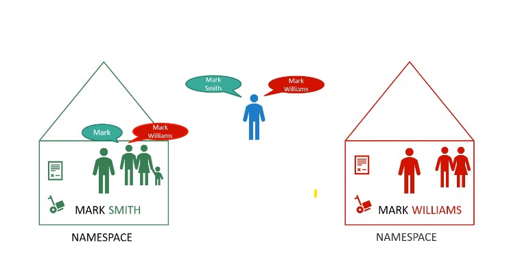

* So far we've been doing everything in the default namespace. 
  * Created automatically when the cluster is first set up
* When cluster is first set up, kubernetes creates a set of pods and services for its internal purpose such as those required by the networking solution, dns service. etc. to isolat them from the user to prevent you from accidentally deleting or modifying the services. 
  * Created under namespace *kube-system* 
* *kube-public*
  * where resources that should be made available to all users are created. 

* If your environment is small you shouldn't really have to worry about namespaces. 
  * As you grow though, the use of namespaces is very important

* Create namespaces too 
  * IE namespace for dev and prod so you don't accidentally modify a resource in production when working in dev. 

### Resource Limits

  * You can also assign a quota of resources to each of these namespaces so it's guarunteed a certain amount and doesn't use more than it's allowed.
  * 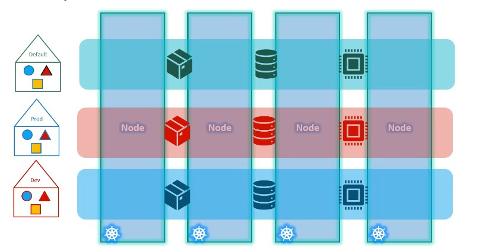

### DNS

* can communicate with the same server easily. But if you want to communicate with something outside of the namespace, you must append the name of the namespace to the name of the service
  * Use the `servicename.namespace.svc.cluster.local` format. In this case it would be `db-service.dev.svc.cluster.local`

* You're able to do this because when the service is created, a DNS entry is added automatically in this format.
* `cluster.local` is the default domain name of the kubernetes cluster. `SVC` is the subdomain. 
  * 

### Commands
  * Get pods in the kube-system namespace
    * `kubectl get pods --namespace=kube-system`
  * Create pod in dev namespace
    *  `kubectl create -f pod-definition.yml --namespace=dev`
    *  Can also move namespace into the pod definition file under metadata section like: 
      ```yaml
      apiVersion: v1
      kind: Pod

      metadata:
        name: myapp-pod
         ### LIKE THIS #######
        namespace: dev
         ##################### 

        labels:
          app: myapp
          type: front-end
      spec:
        containers:
          - name: nginx-container
            image: nginx
      ```
  * Create Namespace Like
   `namespace-dev.yml`
    ```yaml
    apiVersion: v1
    kind: Namespace
    metadata:
      name: dev
    ```
    * `kubectl create -f namespace-dev.yml`
    * `kubectl create namespace dev`
  * Switch default namespace to dev
    * `kubectl config set-context $(kubectl config current-context) --namespace=dev`
  * get pods from all namespaces
    * `kubectl get pods --all-namespaces`
  

  * Create a Resource Quota
    * ```yaml
      apiVersion: v1
      kind: ResurceQuota
      metadata:
        name: compute-quota
        namespace: dev
      
      spec:
        hard:
          pods: "10"
          requests.cpu: "4"
          requests.memory: 5Gi
          limits.cpu: "10"
          limits.memory: 10Gi
      ```
    * `kubectl create -f compute-quota.yaml`

## Services

* enable communication between various components within and outside of the application. 
* Help connect apps together with other apps or users

* IE. App has groups of pods running various sections such as 
  * a group for serving front end load to users 
  * Group for running back end processes
  * Third group connecting to an external data source

* Enable loose coupling between microservices in our application

### Services Use Case

  * External Communication
    * Deployed Pod having web app running on it
    * How do we as an external user access the web page?
      * Kubernetes Node has an IP address that is `192.168.1.2`
      * Laptop is on the same network as well so has IP address `192.168.1.10`
      * The internal POD network is in the range `10.244.0.0` and has an `IP 10.24.0.2`
        * Clearly cannot ping or access the POD at address `10.244.0.2` since it's in a seperate network. 
      
      * Things we could do: 
        * SSH into the kubernetes node at `192.168.1.2` and then from the node, we would be able to access the POD's webpage by doing a curl. Or if the node has a GUI, we could fire up a browser and see the wepgae from `http://10.244.0.2`
          * 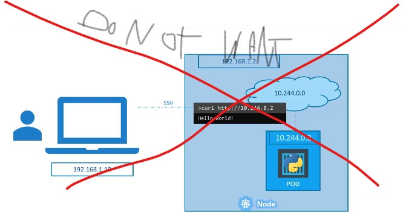
        * That's not what we want though, we want to be able to access the webpage simply by accessing the IP of the kubernetes node. 
      
      * This is where kubernetes service comes into play. 
        * Kubernetes service is an object just like PODs, ReplicaSet or Deployments that we worked with earlier. 
        * Can listen to a port on the Node and forward requests on that port to a port on the POD running the WebApp.

### Service Types - Basics

1. NodePort
   * Makes an internal POD accessible on a Port on the Node.
2. ClusterIP
   * The service creates a virtual IP inside the cluster to enable communication between different services such as a set of front end servers to a set of back end servers. 
3. LoadBalancer
   * Provisions a load balancer for our service in supported cloud providers.
   * Distribute load across the different web servers in your front end tier. 

  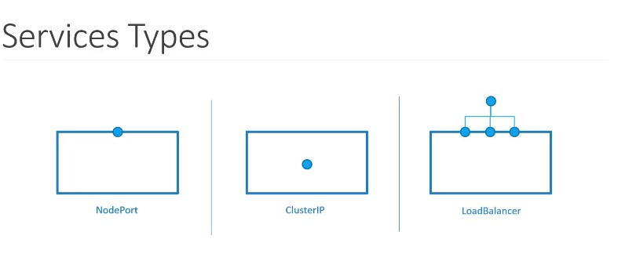


### NodePort

* Three ports involved:
 * Port on the POD where the actual web server is running is **80**
   * Also referred to as the **targetPort**
 * Port on the service itself is just called the **Port**
   * Terms are from the viewpoint of the service.
 * Port on the node itself is running on 300008
   * **NodePort** 
   * Port range from `30000 - 32767`
* 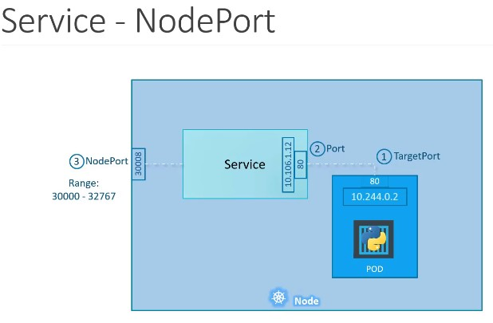

* How to create service
 * `service-definition.yml`
 * ```yaml
     apiVersion: v1
     kind: Service
     metadata:
       name: myapp-service
       ### Can Have Label but don't need that
     
     spec:
       type: NodePort
       ports:
         - targetPort: 80 #an array
           port: 80 #Only mandatory field
           nodePort: 30008
       selector:
         #provide a list of labels and pull values
         #from that in pod metadata section
         app: myapp
         type: front-end
   ```

 * When dones run `kubectl create -f service-definition.yml` to create
 * `kubectl get services` to get the services that are running. 
   * Will give you a `CLUSTER-IP` IP and you can now access that IP using curl or web browser
     * `curl http://192.168.1.2:30008`

* What do you do when you have multiple pods? 
  * We have multiple similar pods running our web application. they all have the same labels with a key app and set to value `myapp`
    * same label is used as a selector during the creation of the service. 
  * So when service is created, it looks for a matching pod with the label and finds three of them
  * Service then automatically selects all the three pods as endpoints to forward the external requests. 
  * **NO ADDITIONAL CONFIG REQUIRED** 

* What about when the web application is on pods in seperate nodes. 


